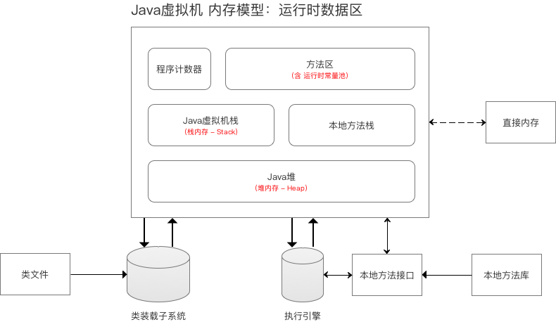
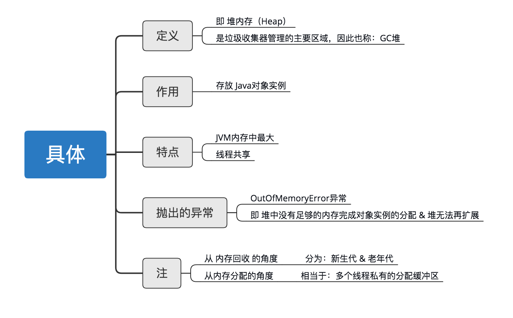
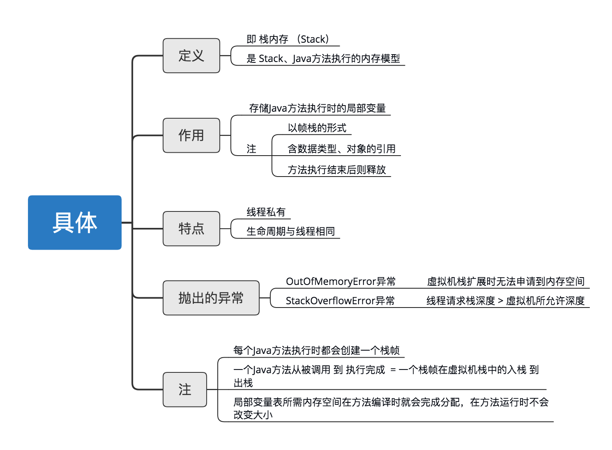
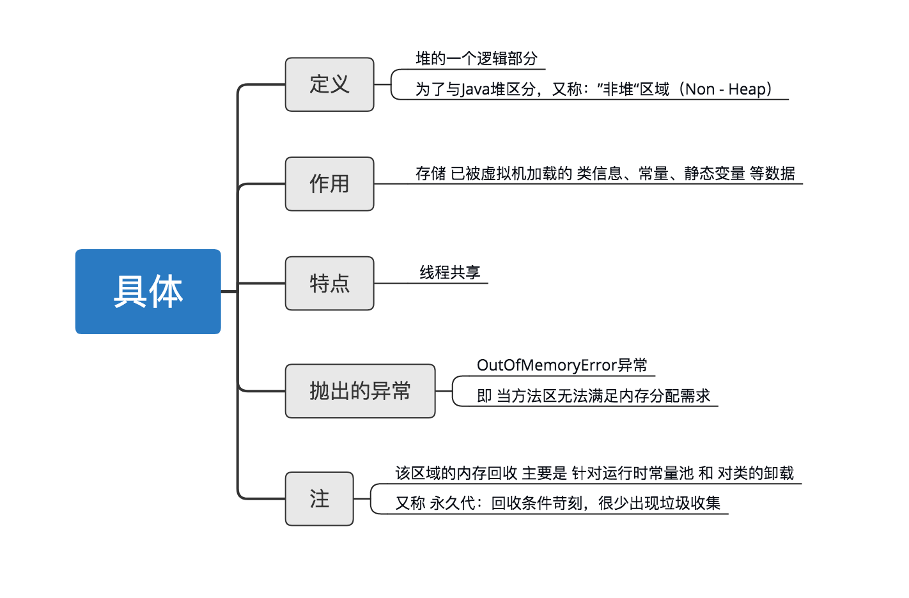
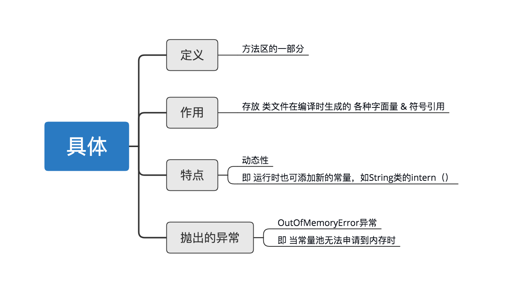
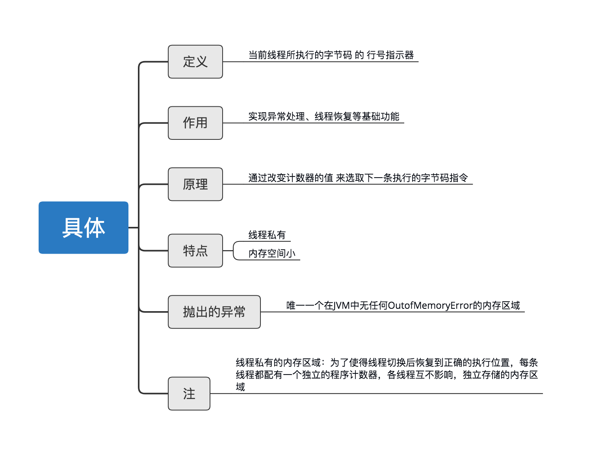
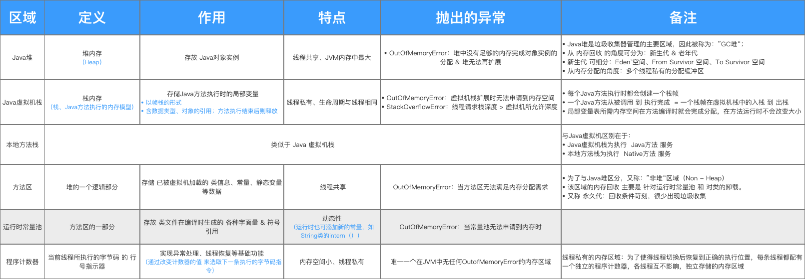

# JVM内存结构


* 堆 (Heap)


* 虚拟机栈(VM Stack)
> 局部变量表存放了编译器可知的各种基本数据类型(boolean、byte、char、short、int、float、long、 double)、对象引用(引用指针，并非对象本身)


* 本地方法栈(Native Method Stack)
> 十分类似Java虚拟机栈，与Java虚拟机区别在于：服务对象，即Java虚拟机栈为执行Java方法服务；
本地方法栈为执行  Native方法服务
  
* 方法区(Method Area / non-heap)(含 运行时常量池)
> 方法区是用于存储类结构信息的地方，包括类的名称、方法信息、字段信息(成员变量)，静态变量，常量


* 注：方法区其内部包含一个运行时常量池
> 方法区中还存在着常量池，常量池包含着一些常量和符号引用（加载类的连接阶段中的解析过程会将符号引用转换为直接引用）


* 程序计数器(Program Counter Register)
> 程序计数器是JVM中一块较小的内存区域，保存着当前线程执行的虚拟机字节码指令的内存地址


总结


例子：
```java
public class JVMTest {//类加载时将类信息放在方法区内，堆内生成java.lang.class对象，持有指向方法区该类的引用

    /*
     * i1,i2都为Integer对象的引用，线程运行时放在java栈中新建的帧栈中
     * 该两个引用执行堆中的Integer实例的引用，而两实例在堆中的地址是不同的，所以，i1==i2返回false
     */
    static Integer i1 = new Integer(1);
    static Integer i2 = new Integer(1);

    /*
     * a,b引用同样放在java栈中帧栈中，指向常量池中的同一内存空间，所以，a==b返回true
     */
    static Integer a = 1;
    static Integer b = 1;

    public static void main(String[] args){//main方法放入方法区
        /**
         * stu是对student对象的引用，放入栈中，指向堆中对象的内存地址。
         * new出来的student对象放在堆中，并持有方法区中student类型信息的引用
         */
        Student stu = new Student("jack");
        
        /**
         * 执行add方法时，根据java栈中stu定位到堆中的对象实例，再根据堆中持有的位于方法区的student类型信息，
         * 获得show()字节码，执行此方法执行，打印出结果
         */
        stu.show();
    }
}

class Student{
    public String name;
    public void show(){
        System.out.println(name);
    }
}
```