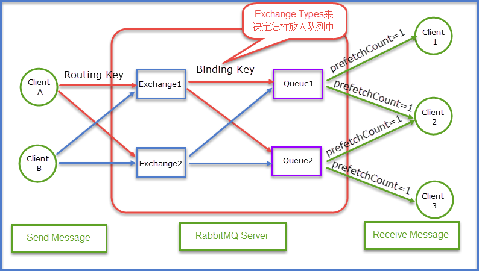

# RabbitMQ
[参考博客](https://www.cnblogs.com/dwlsxj/p/RabbitMQ.html) 

* Exchange
* Queue
* binding key
* routing key

## Exchange Type
* fanout : 把所有发送到该Exchange的消息路由到所有与它绑定的Queue中
* direct : 把消息路由到那些binding key与routing key完全匹配的Queue中
* topic  : 把消息路由到那些binding Key与routing Key模糊匹配的Queue中
* headers: 不依赖于routing key与binding key的匹配规则来路由消息，而是根据发送的消息内容中的headers属性进行匹配。

