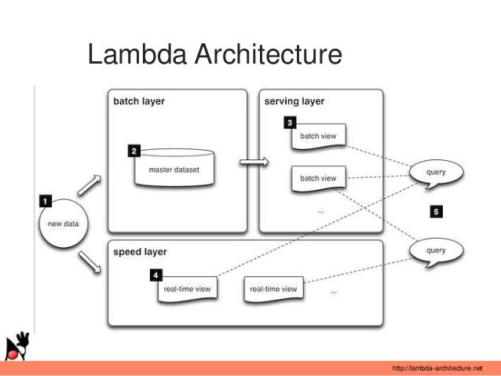

# Lambda架构

> Lambda架构结合了实时处理与批处理的结果，很好的反馈了查询需求，并且在速度和可靠性之间求取了平衡，具有足够的扩展性。 
在Lambda架构之中，所有的查询都可以定位成一个函数：Query = Function(Data)

Lambda架构将数据和计算系统进行细分：Query = Batch(Old_Data) + RealTime(New_Data)
但是这种架构同样存在一些问题：新的逻辑需要两次编码，并且在两个系统中运行和调试代码，多运维一个额外的系统，并且合并查询结果。

Spark本身可以用于批处理，而构建在Spark之上的Spark Streaming又可以用于实时计算，因此利用一套系统来应对批处理和实时计算相结合的业务完全是可行的。

# Kappa架构

Kappa架构的核心思想包括以下三点：
* 用Kafka或者类似的分布式队列系统保存数据，你需要几天的数据量就保存几天。
* 当需要全量重新计算时，重新起一个流计算实例，从头开始读取数据进行处理，并输出到一个新的结果存储中。
* 当新的实例做完后，停止老的流计算实例，并把老的一些结果删除。

# 优缺点对比
|对比项       |Lambda架构  |Kappa架构   |
|------------|------------|------------|
|数据处理能力 |可以处理超大规模的历史数据|历史数据处理的能力有限|
|机器开销     |批处理和实时计算需一直运行，机器开销大 |必要时进行全量计算，机器开销相对较小|
|存储开销     |只需要保存一份查询结果，存储开销较小 |需要存储新老实例结果，存储开销相对较大|
|开发、测试难易程度 |实现两套代码，开发、测试难度较大 只|需面对一个框架，开发、测试难度相对较小|
|运维成本     |维护两套系统，运维成本大 |只需维护一个框架，运维成本小|
