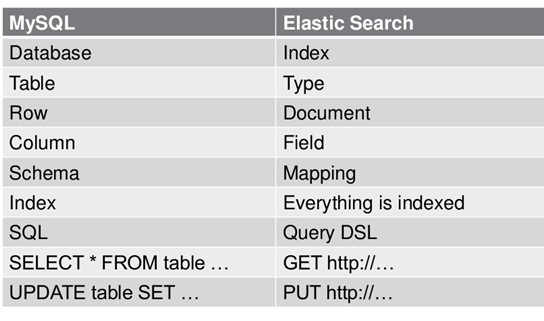

# elasticsearch
> Elasticsearch 是一个分布式的 RESTful 风格的搜索和数据分析引擎。




## Elasticsearch API
> Elasticsearch对外提供的API是以HTTP协议的方式,通过JSON格式以RESTful约定对外提供。HTTP配置文件是放在elasticsearch.ym中

默认
* 9200作为Http协议，主要用于外部通讯，
* 9300作为TCP协议，jar之间就是通过tcp协议通讯，ES集群之间是通过9300进行通讯


* Elasticsearch 查询

1. GET方式
```
curl 'http:localhost:9200/index/type/1'
```

2. POST方式
```
curl -XPOST 'http:localhost:9200/index/type/_search' -d '{
    "query": {
        "match_all": {}
    }
}'
```
    
* Elasticsearch 插入
```
curl -XPOST 'http:localhost:9200/index/typete' -d '{
    
}'
```
    
* Elasticsearch 更新
```
curl -XPOST 'http:localhost:9200/index/type/1/_update' -d '{
    "doc" : {
        
    }
}'
```

* Elasticsearch 删除
```
curl -XDELETE 'http:localhost:9200/index/type/1'
```


