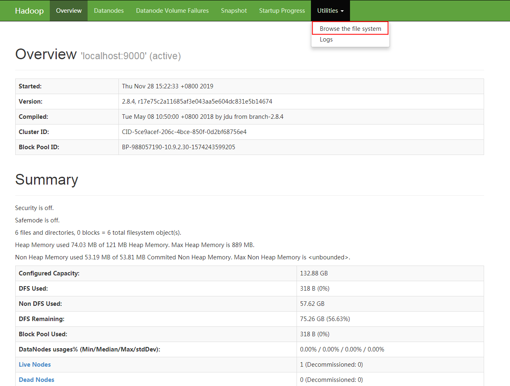
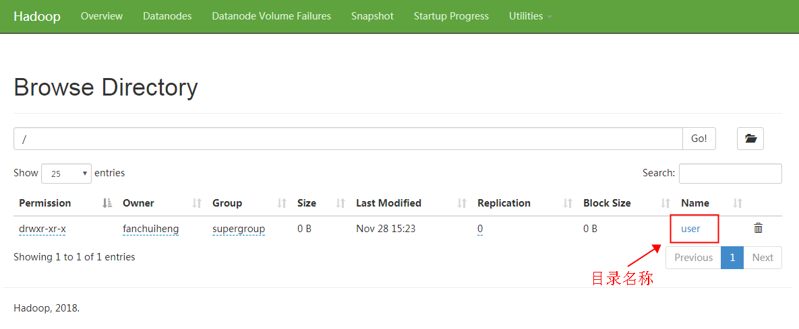

# Hadoop
* Hadoop Common : 基本模块
* Hadoop Distributed File System : 分布式文件系统
* Hadoop YARN : 进行节点资源管理和任务调度
* Hadoop MapReduce : 基于yarn对海量数据进行并行处理
* Hadoop Ozone : 基于HDFS进行对象存储


# 管理后台
默认访问: http://localhost:50070






## HDFS
* NameNode : 管理数据的节点
* Secondary NameNode : 合并NameNode的edit logs到fsimage文件中
* DataNode : 一个大的数据分块存储的节点

### HDFS命令
* 创建文件夹
```
hdfs dfs -mkdir </path>
```

* 创建文件
```
hdfs dfs -touchz </path/flie>
```

* 写入内容
```
echo "<Text>" | hdfs dfs -appendToFile - </path/flie>
```

* 读取内容
```
hdfs dfs -cat </path/flie>
```

* 修改权限
```
hdfs dfs -chmod -R 755 /tmp
```


## YARN
* ResourceManager 是Master上一个独立运行的进程，负责集群统一的资源管理、调度、分配等等
* NodeManager 是Slave上一个独立运行的进程，负责上报节点的状态
* ApplicationMaster 相当于这个Application的监护人和管理者，负责监控、管理这个Application的所有Attempt在cluster中各个节点上的具体运行，同时负责向Yarn ResourceManager申请资源、返还资源等；
* Container 是yarn中分配资源的一个单位，包涵内存、CPU等等资源，YARN以Container为单位分配资源；

### YARN配置
修改文件 YARN 配置文件
* mapred-site.xml
```xml
<property>
    <name>mapreduce.framework.name</name>
    <value>yarn</value>
</property>
```

* yarn-site.xml
```xml
<property>
    <name>yarn.nodemanager.aux-services</name>
    <value>mapreduce_shuffle</value>
</property>
```
默认访问: http://localhost:8088

### YARN 命令
* 查看任务
```
yarn application -list
```
* 结束任务
```
yarn application -kill <application_id>
```

## Spark整合到yarn上步骤
* 设置 HADOOP_CONF_DIR
export HADOOP_CONF_DIR=/home/hadoop/apps/hadoop-2.7.6/etc/hadoop/

* 将hadoop下/etc/hadooop目录下
    core-site.xml  
    hdfs-site.xml  
    yarn-site.xml  
    复制到spark下/conf目录下
    
* 启动Spark-Shell
    spark-shell \  
    --master yarn \  
    --deploy-mode client \  
    --executor-memory 512m \  
    --total-executor-cores 1
    
* 修改spark下/conf目录下
    spark-defaults.conf
    添加配置(SPARK ON YARN 配置 history server)
    * spark.yarn.historyServer.address  
    设置History Server的地址和端口,这个链接将会链接到YARN检测界面上的Tracking UI
