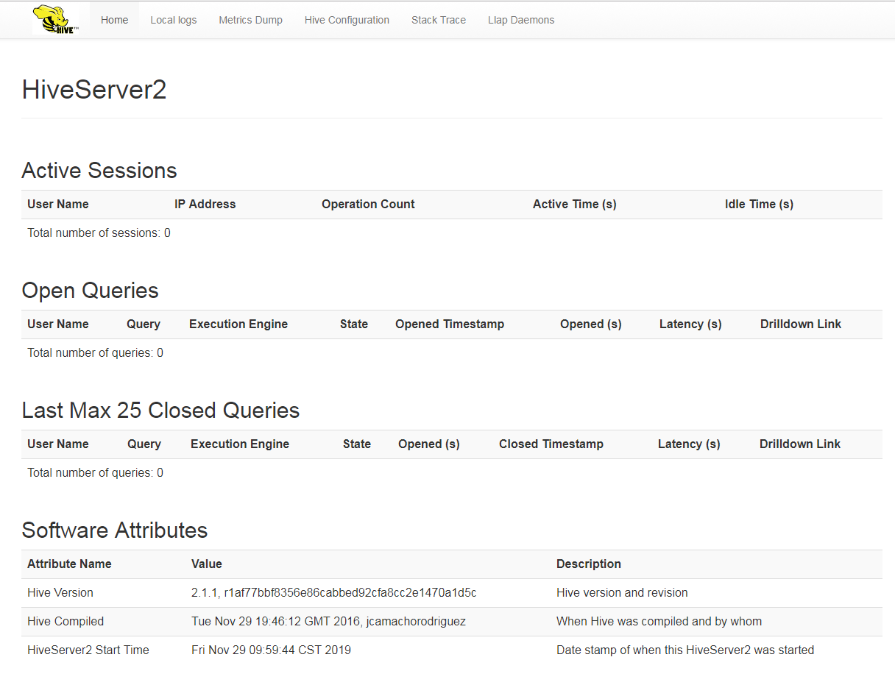
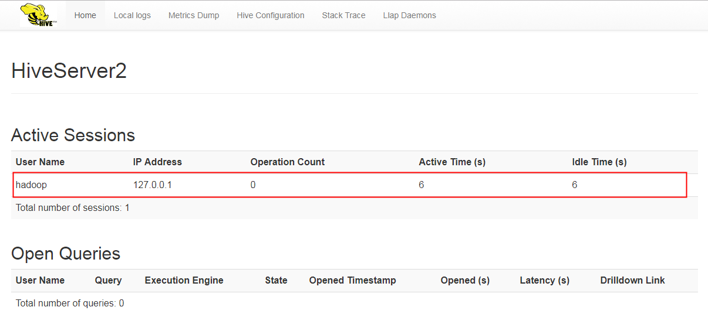

# hive
> Hive是基于Hadoop的一个数据仓库工具，可以将结构化的数据文件映射为一张数据库表，并提供类SQL查询功能。

### hive与hadoop的关系
> hive基于hadoop的HDFS工作，可以将结构性的数据映射成一张数据库表，提供HiveQL语句，并将其转化为MapReduce任务运行在hadoop上

# hive install
* 下载hive部署包并解压
* 下载mysql-connector-java.jar，将其放置在hive的lib目录下
* 添加环境变量HIVE_HOME  

1. 部署Hive之前，需要先搭建Hadoop和MySQL，mysql数据库用于存放元数据（默认数据库为Derby）。  
```
<property>
    <name>javax.jdo.option.ConnectionURL</name>
    <value>jdbc:mysql://localhost:3306/hive</value>
</property>

<property>
    <name>javax.jdo.option.ConnectionDriverName</name>
    <value>com.mysql.jdbc.Driver</value>
</property>

<property>
    <name>javax.jdo.option.ConnectionUserName</name>
    <value>root</value>
</property>

<property>
    <name>javax.jdo.option.ConnectionPassword</name>
    <value>password</value>
</property>
```
* 创建数据库 hive 
```
CREATE DATABASE IF NOT EXISTS hive DEFAULT CHARSET utf8 COLLATE utf8_general_ci;
```
* 执行初始化脚本
```
schematool -initSchema -dbType mysql
```

2. 设置HIVE_HOME变量，修改 /conf/hive-env.sh
```
HADOOP_HOME=${HADOOP_HOME}
export HIVE_CONF_DIR=${HADOOP_HOME}/conf
```

3. 启动metastore
```
hive --service metastore
```

配置hive所需的一些目录，${HIVE_HOME}表示hive所在目录
```
<property>
    <name>hive.exec.local.scratchdir</name>    
    <value>${HIVE_HOME}/hive/scratch_dir</value>
</property>
<property>
    <name>hive.downloaded.resources.dir</name>    
    <value>${HIVE_HOME}/hive/resources_dir/${hive.session.id}_resources</value>    
</property>
<property>
    <name>hive.querylog.location</name>
    <value>${HIVE_HOME}/hive/querylog_dir</value>
</property>
<property>
    <name>hive.server2.logging.operation.log.location</name>
    <value>${HIVE_HOME}/hive/operation_dir</value>
</property>
```


## hiveserver2
> 操作Hive只需要通过它提供的客户端即可，Hive提供了大致三类客户端
* CLI (Hive 命令行模式)
* WebUI : 例如 (HUE / Zeppelin)
* Client (Hive的远程服务) : 在Hive 0.11.0版本之后，提供了hiveserver2服务，通过jdbc协议可以访问hive，hiveserver2支持高并发。



hive-size.xml 配置如下
```
<property>
    <name>hive.server2.webui.host</name>
    <value>localhost</value>
</property>
<property>
    <name>hive.server2.webui.port</name>
    <value>10002</value>
</property>
```

其他参数说明
* hive.server2.transport.mode – 默认值为binary(TCP)，可选值HTTP。    
* hive.server2.thrift.http.port – HTTP的监听端口，默认值为10001。
* hive.server2.thrift.min.worker.threads – 最小工作线程数，默认为5。
* hive.server2.thrift.max.worker.threads – 最大工作线程数，默认为500。
* hive.server2.thrift.port – TCP 的监听端口，默认为10000。
* hive.server2.thrift.bind.host – TCP绑定的主机，默认为localhost。


启动命令
```
hive --service hiveserver2
```

附: 启动失败，查看一下端口是否被占用


### 启动beeline连接server
```
beeline -u jdbc:hive2://hadoop00:10000
```
查看WebUI,可看到有一个连接已经连上了server  


连接JDBC客户端程序连接hive时，出现报错(User: XXX is not allowed to impersonate anonymous)  
解决办法 : 在hadoop的core-site.xml文件添加两个属性
```
<property>
    <name>hadoop.proxyuser.[username].groups</name>
    <value>*</value>
</property>

<property>
    <name>hadoop.proxyuser.[username].hosts</name>
    <value>*</value>
</property>
```

### 使用JDBC连接hiveserver2
```
String classDriver = "org.apache.hive.jdbc.HiveDriver";
String url = "jdbc:hive2://localhost:10000/default";
Class.forName(classDriver);
connection = DriverManager.getConnection(url);
```


### 其他操作
查找hive表在hdfs中的存储位置
```
show create table <table_name>;
```
其中LOCATOIN就是hive在hdfs中的存储目录