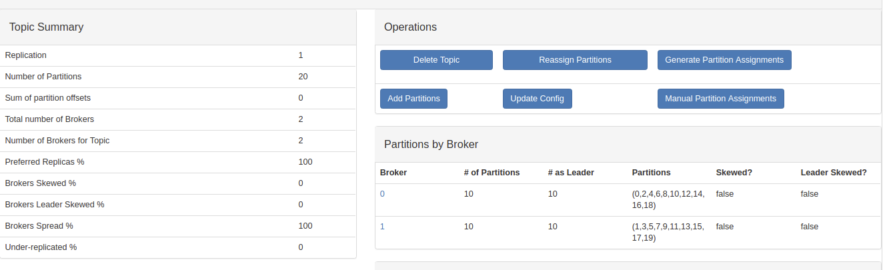
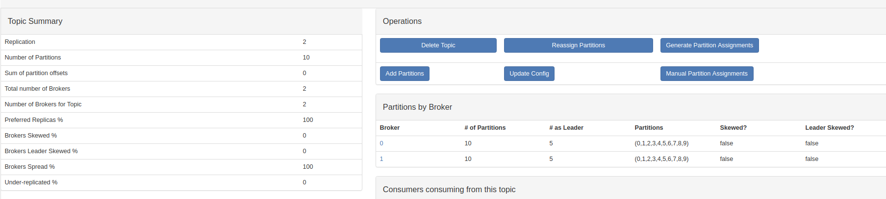

# windows 环境安装 Kafka
1. 安装JDK
2. 安装Zookeeper, 添加环境变量: ZOOKEEPER_HOME, 运行zookeeper
3. 下载解压 kafka, 启动kafka通讯的服务器broker
```
./bin/windows/kafka-server-start.bat ./config/server.properties
```

命令会提示错误: 找不到或无法加载主类 Files\Java\jdk1.7.0_80\lib;C:\Program  
* 原因: jdk路径中存在空格导致  
* 解决方式: 在kafka安装目录中找到bin\windows目录中的kafka-run-class.bat，为%CLASSPATH%加上双引号  
* 修改后代码:  
```
set COMMAND=%JAVA% %KAFKA_HEAP_OPTS% %KAFKA_JVM_PERFORMANCE_OPTS% %KAFKA_JMX_OPTS% %KAFKA_LOG4J_OPTS% -cp "%CLASSPATH%" %KAFKA_OPTS% %*
```

4. 创建kafka的消息topics
```
kafka-topics.bat --create --zookeeper localhost:2181 --replication-factor 1 --partitions 2 --topic test_topic
```
* --replication-factor : 用来设置主题的副本数。每个主题可以有多个副本，副本位于集群中不同的broker上，也就是说副本的数量不能超过broker的数量，否则创建主题时会失败。
* --partitions : kafka通过分区策略，将不同的分区分配在一个集群中的broker上。

比如 Broker为2，partitions 设置为20，replicationFactor设置为1。可以看出，分区会均匀在broker


比如 Broker为2，partitions 设置为10，replicationFactor设置为2。每个broker都有副本存在



5. 创建Producer
```
kafka-console-producer.bat --broker-list localhost:9092 --topic test_topic
```

6. 创建Consumer
```
kafka-console-consumer.bat --bootstrap-server localhost:9092 --topic test_topic
```


## kafka 配置 server.properties

* kafka数据的存放地址
```
log.dirs=/tmp/kafka-logs
```

* 数据存储的最大时间(hours|minutes)，默认为7天（168小时）。超过这个时间会根据log.cleanup.policy处理数据。
```
log.retention.hours=168
```

* 日志数据存储的最大字节数。超过这个时间会根据log.cleanup.policy处理数据。
```
log.retention.bytes=1073741824
```

* 日志清理策略选择有: delete和compact。主要针对过期数据的处理，或是日志文件达到限制的额度。该参数会被 topic创建时的指定参数覆盖
```
log.cleanup.policy=delete
```

* broker server服务端口
```
port =9092
```

* zookeeper集群的地址
```
zookeeper.connect=localhost:2181
```


### Kafka动态调整topic副本因子replication-factor
原因分析：假设我们有3个kafka broker，分别为 brokerA、brokerB、brokerC  
当我们创建的topic有3个分区partition时并且replication-factor为1时，基本上一个broker上一个分区。当一个broker宕机了，该topic就无法使用了  
当我们创建的topic有3个分区partition时并且replication-factor为2时，可能分区数据分布情况是  
brokerA - partition0，partition1  
brokerB - partition1，partition2  
brokerC - partition2，partition0  
每个分区有一个副本，当其中一个broker宕机了，kafka集群还能完整凑出该topic的三个分区，例如当brokerA宕机了，可以通过brokerB和brokerC组合出topic的三个分区。


## docker 安装 Kafka

```
docker-compose -f docker-compose-kafka.yml up
```

```
version: '2'
services:
  zoo1:
    image: wurstmeister/zookeeper
    hostname: zoo1
    ports:
      - "2181:2181"
    container_name: zookeeper

  # kafka version: 1.1.0
  # scala version: 2.12
  kafka1:
    image: wurstmeister/kafka
    ports:
      - "9092:9092"
    environment:
      KAFKA_ADVERTISED_HOST_NAME: 192.168.99.100
      KAFKA_ZOOKEEPER_CONNECT: "zoo1:2181"
      KAFKA_BROKER_ID: 1
      KAFKA_OFFSETS_TOPIC_REPLICATION_FACTOR: 1
      KAFKA_CREATE_TOPICS: "test-topic,stream-in:1:1,stream-out:1:1"
    depends_on:
      - zoo1
    container_name: kafka
```

# docker 安装 Kafka-manager

[Kafka-manager](https://hub.docker.com/r/kafkamanager/kafka-manager/tags)

```
docker run -d -e ZK_HOSTS=192.168.99.100 -p 9000:9000 kafkamanager/kafka-manager
```
