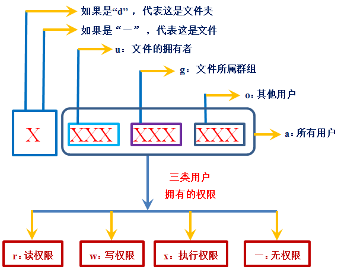

#linux
1. 查看端口的占用情况
```
netstat -anp|grep <port>
```

2. 查看进程的详细信息
```
ps -ef|grep <process_name>
```
* -e 显示所有进程
* -f 全格式
* grep 全局正则表达式版本

|UID               | PID      |PPID    |C     |STIME    |TTY     |TIME       |CMD              |
|------------------|----------|--------|------|---------|--------|-----------|-----------------|
|java_app          |14124     |13991   | 0    | 00:38   | pts/0  | 00:00:00  |java -jar app.jar|
|用户ID            | 程序的ID  |        |      |         |        |           |所下达的指令      |

3. 结束进程
```
kill -9 `pid`
```

4. 查看某个进程内部线程占用情况分析
```
top -H -p `pid`
```


5. 文本输出
```
cat `file_name` | grep `查询内容`
tail -f `file_name` | grep `查询内容`
```

6. http命令行工具
* curl  `option`  `url`
    * curl `url`
    * curl -X POST -H 'Content-type':'application/json'  -d '{"page":"1"}'  `url`
    
7. 查看所有子目录大小
```
du -sh *
```

8. 修改权限
```
chmod [-R] 777 /tmp
```
-R : 递归修改
权限 : 4读取，2写入，1执行
