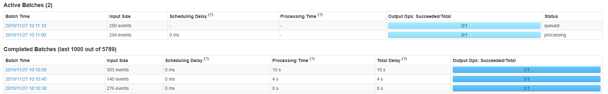
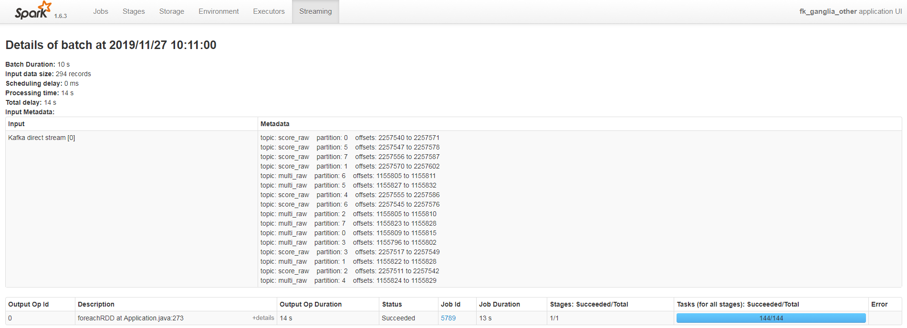

### spark 参数
```
SparkConf sparkConf = new SparkConf().setAppName("SparkStreaming").setMaster("local[*]"); 
JavaStreamingContext javaStreamingContext = new JavaStreamingContext(sparkConf, Durations.seconds(10));
```
Durations.seconds(10)设置的是sparkStreaming批处理的时间间隔，每个Batch Duration时间去提交一次job。  
如果job的处理时间超过Batch Duration，会使得job无法按时提交，随着时间推移，越来越多的作业被拖延，最后导致整个Streaming作业被阻塞，无法做到实时处理数据







* spark.streaming.kafka.maxRatePerPartition  
限制 每秒 每个消费线程 读取 每个kafka分区 最大的数据量  


* Spark：集群上运行jar程序，状态一直Accepted且不停止不报错
一般是由于 有多个用户同时向集群提交任务 或 一个用户向集群同时提交了多个任务 导致Yarn资源的分配错误。  
解决这个问题，只需要更改Hadoop的配置文件：/etc/hadoop/conf/capacity-scheduler.xml，把选项：yarn.scheduler.capacity.maximum-am-resource-percent从0.1改成0.5。  
这个选项是增加Yarn可调度的资源量，当然也可以视具体情况增加更多。默认情况下，Yarn没有将很多资源分配给任务的能力。