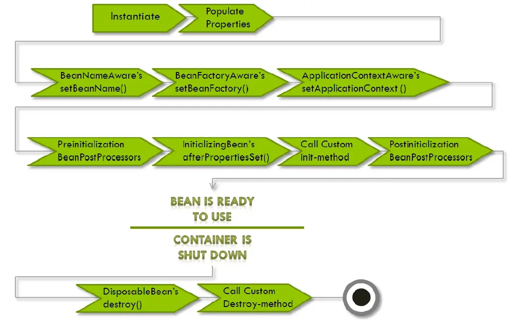

# Spring Initialization


Instantiate -> Populate Properties  ->  
BeanNameAware.setBeanName -> BeanFactoryAware.setBeanFactory -> ApplicationContextAware.setApplicationContext ->  
PreInitialization(BeanPostProcessors) -> InitializingBean.afterPropertiesSet -> Call Custom init-method ->  PostInitialization(BeanPostProcessors) ->  
DisposableBean.destroy -> call Custom Destroy-method


# Spring Bean InitializingBean / DisposableBean
> 在Spring中，InitializingBean 和 DisposableBean是两个标记接口，为Spring执行时bean的 初始化 和 销毁 某些行为时的有用方法。

* 对于 Bean 实现 InitializingBean，它将运行 afterPropertiesSet() 在所有的bean属性被设置之后。
* 对于 Bean 实现 DisposableBean，它将运行 destroy() 在Spring容器释放该bean之后。


## InitializingBean
* spring为bean提供了两种初始化bean的方式，实现InitializingBean接口，实现afterPropertiesSet方法，或者在配置文件中同过init-method指定，两种方式可以同时使用
* 实现InitializingBean接口是直接调用afterPropertiesSet方法，比通过反射调用init-method指定的方法效率相对来说要高点。但是init-method方式消除了对spring的依赖
* 如果调用afterPropertiesSet方法时出错，则不调用init-method指定的方法。
* @PostConstruct注解后的方法在BeanPostProcessor前置处理器中就被执行了，要先于InitializingBean和init-method执行了。


```java
public class MyInitializingBean implements InitializingBean {
    public MyInitializingBean() {
        System.out.println("MyInitializingBean....");
    }

    @Override
    public void afterPropertiesSet() throws Exception {
        System.out.println("MyInitializingBean>>>>>>>>>>>>>>>>>>>");
    }

    @PostConstruct  //功能上近似init-method，但加载时机不同
    public void postConstruct(){
        System.out.println("PostConstruct >>>>>>>>>>>>");
    }

    public void initMethod(){
        System.out.println("init-method");
    }
}
```
执行顺序: Constructor > @PostConstruct > InitializingBean > init-method  
具体参照方法:  
```
AbstractAutowireCapableBeanFactory.initializeBean => 
AbstractAutowireCapableBeanFactory.applyBeanPostProcessorsBeforeInitialization => 
AbstractAutowireCapableBeanFactory.invokeInitMethods
```

调用顺序:  
--> Spring IOC容器实例化Bean
--> 调用BeanPostProcessor 的 postProcessBeforeInitialization 方法 (@PostConstruct在此，参考 CommonAnnotationBeanPostProcessor => InitDestroyAnnotationBeanPostProcessor)
--> 调用bean实例的初始化方法(invokeInitMethods-> InitializingBean -> init-method)
--> 调用BeanPostProcessor的postProcessAfterInitialization方法


## DisposableBean
* 在Bean生命周期结束前调用 destroy() 方法做一些收尾工作，亦可以使用 destroy-method

具体参照:
AbstractApplicationContext.refresh() =>
ConfigurableListableBeanFactory.obtainFreshBeanFactory() => 
AbstractRefreshableApplicationContext.refreshBeanFactory() => destroyBeans() =>
DefaultListableBeanFactory.destroySingletons() => disposableBeans (该方法遍历的是该集合，集合中加入元素的方法) 
=>
AbstractBeanFactory.registerDisposableBeanIfNecessary() => DisposableBeanAdapter (使用的是适配者类 的 destroy方法)

调用顺序:
--> @PreDestroy 方法
--> DisposableBean.destroy()
--> destroy-method
