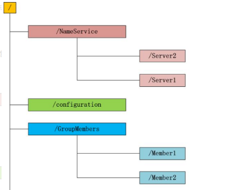
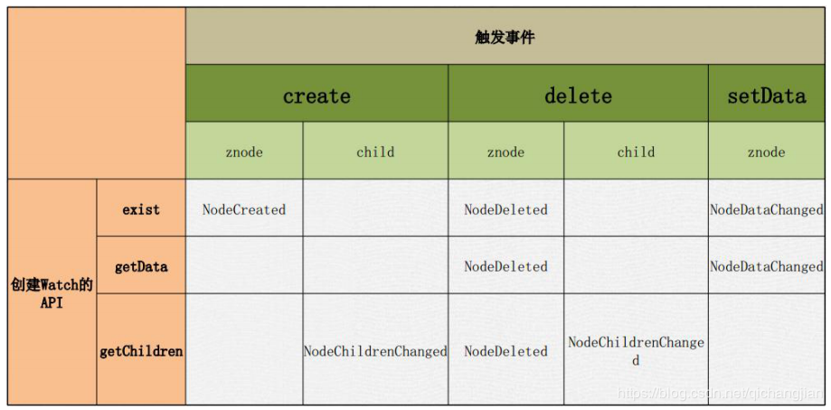

# Zookeeper
> Zookeeper是一个分布式的，开放源代码的分布式应用程序协调服务。
如：分布式同步，配置管理，集群管理，命名管理，队列管理。

zookeeper=文件系统+监听通知机制
1. 文件系统  
Zookeeper维护一个类似文件系统的数据结构  


zookeeper的文件系统的特点：
* zk的文件系统和Linux的文件系统目录结构一样，从 / 开始
* zk的访问路径只有绝对路径，没有相对路径
* zk中没有文件和目录的概念，只有znode节点，Znode既有文件的功能，又有目录的功能

2. 监听通知机制  
客户端注册监听它关心的目录节点，当目录节点发生变化（数据改变、被删除、子目录节点增加删除）时，zookeeper会通知客户端。  

* zookeeper客户端与zookeeper server连接的状态
    
|连接状态                  |状态含义|
|-------------------------|-------|
|KeeperState.Expired      |	客户端和服务器在ticktime的时间周期内，是要发送心跳通知的。这是租约协议的一个实现。客户端发送request，告诉服务器其上一个租约时间，服务器收到这个请求后，告诉客户端其下一个租约时间是哪个时间点。当客户端时间戳达到最后一个租约时间，而没有收到服务器发来的任何新租约时间，即认为自己下线（此后客户端会废弃这次连接，并试图重新建立连接）。这个过期状态就是Expired状态|
|KeeperState.Disconnected |当客户端断开一个连接（可能是租约期满，也可能是客户端主动断开）这是客户端和服务器的连接就是Disconnected状态|
|KeeperState.SyncConnected|一旦客户端和服务器的某一个节点建立连接（注意，虽然集群有多个节点，但是客户端一次连接到一个节点就行了），并完成一次version、zxid的同步，这时的客户端和服务器的连接状态就是SyncConnected|
|KeeperState.AuthFailed   |zookeeper客户端进行连接认证失败时，发生该状态|


* zookeeper中的事件。当zookeeper客户端监听某个znode节点 /node-x

|zookeeper事件                |事件含义|
|-----------------------------|-------| 
|EventType.NodeCreated        |当node-x这个节点被创建时，该事件被触发| 
|EventType.NodeChildrenChanged|当node-x这个节点的直接子节点被创建、被删除、子节点数据发生变更时，该事件被触发。  |
|EventType.NodeDataChanged    |当node-x这个节点的数据发生变更时，该事件被触发  |
|EventType.NodeDeleted        |当node-x这个节点被删除时，该事件被触发。  |
|EventType.None               |当zookeeper客户端的连接状态发生变更时，即KeeperState.Expired、KeeperState.Disconnected、KeeperState.SyncConnected、KeeperState.AuthFailed状态切换时，描述的事件类型为EventType.None  |



* zookeeper节点类型CreateMode

|节点类型               | 含义  |
|----------------------|-------| 
|PERSISTENT            | 持久化目录节点, 会话结束存储数据不会丢失 | 
|PERSISTENT_SEQUENTIAL | 顺序自动编号持久化目录节点, 存储数据不会丢失, 会根据当前已存在节点数自动加1, 然后返回给客户端已经创建成功的节。例如：创建节点时path输入的是test，当客户端退出时path将变成test0000000001，该值（0000000001）会自动增长！ | 
|EPHEMERAL             | 临时目录节点, 一旦创建这个节点当会话结束, 这个节点会被自动删除 | 
|EPHEMERAL_SEQUENTIAL  | 临时自动编号节点, 一旦创建这个节点, 当回话结束, 节点会被删除, 并且根据当前已经存在的节点数自动加1, 然后返回给客户端已经成功创建的目录节点名 | 

## Zookeeper 命令
* 查看znode中所包含的内容
```
ls  /
```

* 创建znode
```
create /myZnode myData
```

* 获取znode信息
```
get /myZnode
```

* 修改znode
```
set /myZnode helloWorld
```

* 删除znode
```
delete /myZnode
```

## Java API操作zookeeper
1. 添加依赖
```xml
<dependency>
    <groupId>org.apache.zookeeper</groupId>
    <artifactId>zookeeper</artifactId>
    <version>3.4.6</version>
</dependency>
```
2. 对应监听类实现 org.apache.zookeeper.Watcher


## Zookeeper 框架Curator
> Curator是Netflix公司开源的一套Zookeeper客户端框架。
Curator帮助我们在 Zookeeper原生API 基础上进行封装、实现一些开发细节，包括接连重连、反复注册Watcher和NodeExistsException等

```xml
<dependency>
    <groupId>org.apache.curator</groupId>
    <artifactId>curator-recipes</artifactId>
    <version>2.12.0</version>
</dependency>
```
